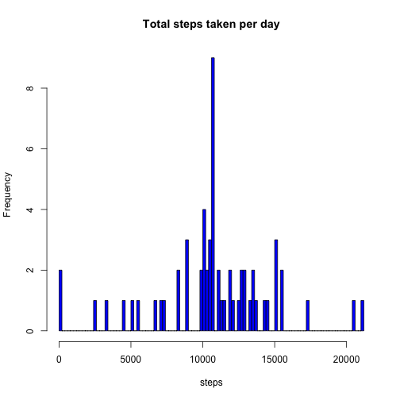
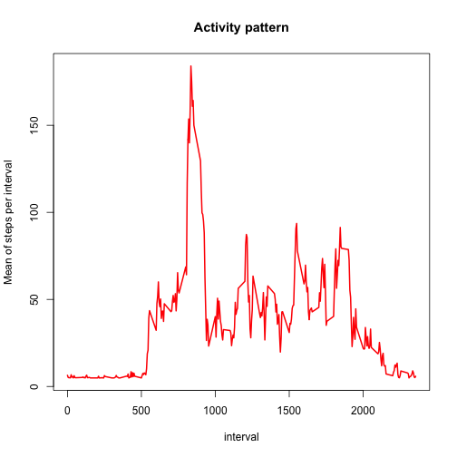
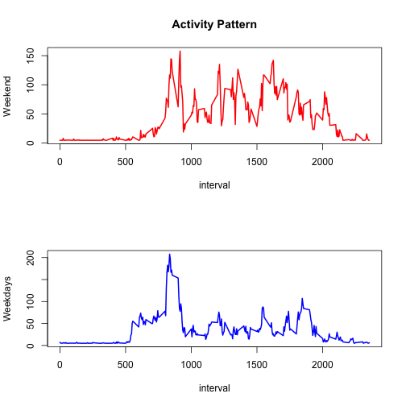

This is the first exercise of two peer assesments for the course Reproducible Research taught by Roger Peng. Here we are going to use a database measuring one "quantified self" as the introduction of the exercise likes to call them. 

\textbf{1. Loading and Preprocessing the data:} 

Here we are going to store the csv given into a readable database, so that we can "play" with it.  

```r
db <- read.csv("activity.csv")
```

```
## Warning in file(file, "rt"): cannot open file 'activity.csv': No such file
## or directory
```

```
## Error in file(file, "rt"): cannot open the connection
```

```r
head(db)
```

```
##     steps       date interval
## 1 37.3826 2012-10-01        0
## 2 37.3826 2012-10-01        5
## 3 37.3826 2012-10-01       10
## 4 37.3826 2012-10-01       15
## 5 37.3826 2012-10-01       20
## 6 37.3826 2012-10-01       25
```

\textbf{2. What is mean total number of steps taken per day?}

Ignoring the missing values in the dataset, we now calculate the total number of steps taken per day, but first we need to install and work with a package called "dplyr".


```r
library(dplyr)
```

Now we use the functions of the package to group the database in order to calculate the total number of steps taken per day: 


```r
db1 <- summarise(group_by(db,date), sum_steps_day=sum(steps, na.rm=TRUE))
```

Here we can find a histogram of the steps taken per day:


```r
hist(db1$sum_steps_day,main="Total steps taken per day", xlab= "steps", breaks=100, freq=TRUE, col="blue")
```

 

Now we can calculate the mean and the median of the steps taken:

```r
mspd <- mean(db1$sum_steps_day,na.rm=TRUE)
mdnspd <- median(db1$sum_steps_day,na.rm=TRUE)
mspd;mdnspd
```

```
## [1] 10766.19
```

```
## [1] 10766.19
```


\textbf{3. What is the average daily activity pattern?}

With the following code we can have a suitable dataset to answer the question. 

```r
db2 <- summarise(group_by(db,interval), mean_interval=mean(steps, na.rm=TRUE))
head(db2)
```

```
## Source: local data frame [6 x 2]
## 
##   interval mean_interval
## 1        0      6.394439
## 2        5      5.197718
## 3       10      5.017390
## 4       15      5.033784
## 5       20      4.968210
## 6       25      6.722308
```

Now we can easily compute and graph the plot of the activity pattern that one can get from the dataset above.

```r
plot(db2,type='l', main="Activity pattern", ylab= "Mean of steps per interval", col="red", lwd=2)
```

 

The maximum number of steps (as a mean) can be found in the 750-780 intervals. 

\textbf{4. Imputing missing values}

The number of missing values is given by the following sum:

```r
sum(is.na(db$steps))
```

```
## [1] 0
```

Now we replace those values by the mean of the means of intervals computed in the last point. 

```r
db[is.na(db)] <- mean(db2$mean_interval)
db_nomv <- db
```

Now that we have the new dataset, we can make the histogram with no missing values, and compute the corresponding mean and median:


```r
db1_nomv <- summarise(group_by(db_nomv,date), sum_steps_day=sum(steps, na.rm=TRUE))
hist(db1_nomv$sum_steps_day,main="Total steps taken per day", xlab= "steps", breaks=100, freq=TRUE, col="blue")
```

 

```r
mspd2 <- mean(db1_nomv$sum_steps_day,na.rm=TRUE)
mdnspd2 <- median(db1_nomv$sum_steps_day,na.rm=TRUE)
mspd2;mdnspd2
```

```
## [1] 10766.19
```

```
## [1] 10766.19
```

That shows us first that the median and the mean are the same value for the second dataset, since its likely that the missing values gather around the mean and that force the median to be the same; and second, both the mean and the median in the second exercise are above the measures computed first. The histogram also shows that there is a significant bar around the mean. 

\textbf{5. Are there differences in activity patterns between weekdays and weekends?}


```r
library(timeDate)
db_nomv[,2]<- as.Date(db_nomv$date, format = "%Y-%m-%d")
db_nomv <- mutate(db_nomv, isWeekend=isWeekend(date))
dsT <- filter(db_nomv, isWeekend == TRUE)
dsF <- filter(db_nomv, isWeekend == FALSE)   
```

We can now plot the information collected above and see the differences between weekdays and weekends, if any:

```r
dsT2 <- summarise(group_by(dsT,interval), mean_interval=mean(steps, na.rm=TRUE))
dsF2 <- summarise(group_by(dsF,interval), mean_interval=mean(steps, na.rm=TRUE))
par(mfrow=c(2,1))
plot(dsT2,type='l', main="Activity Pattern", ylab= "Weekend", col="red", lwd=2)
plot(dsF2,type='l', ylab= "Weekdays", col="blue", lwd=2)
```

 

      
The plot above that on the weekends there is more activity on the subsequent intervals after the morning than there is on the weekdays. That corresponds to what an average quantified self would normally do, since there's more activity (jogging, shopping, exercising, visiting some friends) than there is at the office. 


